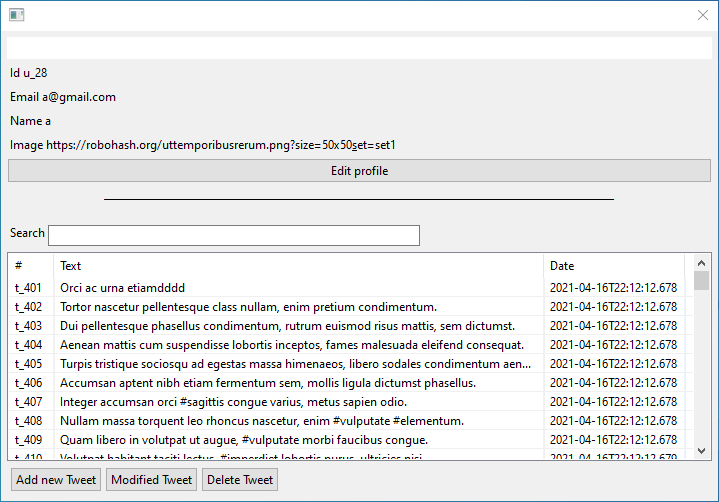
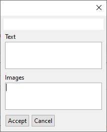

# UNQ » UIs » TP Twitter 

[](https://jitpack.io/#unq-ui/2021s1-twitter)

Twitter es una plataforma donde los usuarios pueden compartir texto y fotos. También pueden pueden comentar publicaciones ajenas y compartirlas con el resto de su red.

## Especificación de Dominio

### Dependencia

Agregar el repositorio:

```xml
<repositories>
    <repository>
        <id>jitpack.io</id>
        <url>https://jitpack.io</url>
    </repository>
</repositories>
```

Agregar la dependencia:

```xml
<dependency>
	    <groupId>com.github.unq-ui</groupId>
	    <artifactId>2021s1-twitter</artifactId>
	    <version>1.0.2</version>
</dependency>
```

Toda interacción con el dominio se hace a través de la clase `TwitterSystem`. La programación del dominio ya es proveído por la cátedra.

Para utilizar el system con información existen dos maneras.

Puede generar de cero la instancia y agregar la información que necesite:

```kotlin
import org.ui.model.TwitterSystem
import org.ui.model.DraftTweet

val system = TwitterSystem()

val a1 = system.register("Name 1","name1@gmail.com", "pass1","https://pix.example/1.png")
val a2 = system.register("Name 2","name2@gmail.com", "pass2","https://pix.example/2.png")
val a3 = system.register("Name 3","name3@gmail.com", "pass3","https://pix.example/3.png")

system.addTweet(a1.id, DraftTweet("description1", mutableListOf("https://imgageLink.com/portrait1.png", "https://imgageLink.com/landscape1.png")))
system.addTweet(a2.id, DraftTweet("description2", mutableListOf("https://imgageLink.com/portrait2.png", "https://imgageLink.com/landscape2.png")))
system.addTweet(a3.id, DraftTweet("description3", mutableListOf("https://imgageLink.com/portrait3.png", "https://imgageLink.com/landscape3.png")))
```

O puede utilizar el _system_ pre-cargado por la cátedra:

```kotlin
import org.ui.bootstrap.getTwitterSystem

val system = getTwitterSystem()
```

### `TwitterSystem`

```kotlin

// @Throw NotFound si `email` o `password` son incorrectos
fun login(email: String, password: String): User

// @Throw UsedEmail si `email` ya está en uso
fun register(name: String, email: String, password: String, image: String): User

// @Throw NotFound si `userId` no existe
fun getUser(userId: String): User

// @Throw NotFound si `tweetId` no existe
fun getTweet(tweetId: String): Tweet

// @Throw NotFound si `userId` no existe
fun editProfile(userId: String, name: String, password: String, image: String): User

// @Throw NotFound si `userId` no existe
fun addTweet(userId: String, draftTweet: DraftTweet): Tweet

// @Throw NotFound si `tweetId` no existe
fun editTweet(tweetId: String, draftTweet: DraftTweet): Tweet

fun deleteTweet(tweetId: String): Unit

// @Throw NotFound si `tweetId` o `fromUserId` no existen
fun addComment(tweetId: String, userId: String, commetTweet: DraftTweet) : Tweet

// @Throw NotFound si `tweetId` o `userId` no existen
fun updateLike(tweetId: String, userId: String): Tweet

// @Throw NotFound si `tweetId` o `userId` no existen
fun updateFollower(fromUserId: String, toUserId: String): Unit

// @Throw NotATag si el tag parametro no contine `#`
fun searchByTag(tag: String): List<Tweet>

fun searchByUserName(name: String): List<Tweet>

fun searchByUserId(userId: String): List<Tweet>

fun searchByName(name: String): List<User>

// @Throw NotFound si `userId` no existe
fun timeline(userId: String): List<Tweet>
```

### User

Es el usuario del sistema.

```kotlin
data class User(
    val id: String,
    var name: String,
    val email: String,
    var password: String,
    var image: String,
    val followers: MutableList<User>,
    val tweets: MutableList<Tweet> = mutableListOf()
)
```

### Tweet

Es el tweet ya creado

```kotlin
data class Tweet(
    val id: String,
    val author: User,
    var text: String,
    val reply: Tweet? = null,
    var images: MutableList<String> = mutableListOf(),
    val date: LocalDateTime,
    val comments: MutableList<Tweet> = mutableListOf(),
    val likes: MutableList<User> = mutableListOf()
)
```

### DraftTweet

Es el tweet antes de ser guardado por el sistema

```kotlin
data class DraftTweet(val text: String, val images: MutableList<String> = mutableListOf())
```

### `DraftComment`

Es el reply de un tweet antes de ser guardado por el sistema. (Luego se genera un tweet)

```kotlin
data class DraftReply(val text: String, val images: MutableList<String> = mutableListOf())
```

## Parte 1: Interfaz Desktop con Arena

Se debe realizar una aplicación de escritorio utilizando [Arena Framework](http://arena.uqbar-project.org/).
Se debe armar un **ABM de Tweets** en donde el usuario (`User`) se debe poder.
_loguear_ **(no hace falta registrarse)** y crear, modificar y eliminar sus twiits.

_Algunas aclaraciones:_
- Solo se deben poder cargar hasta 4 imagenes en los tweets.
- Para evitar complejizar la ventana de creación de Tweets, las imagenes no es necesario representarlas como listas. Se pueden utilizar 4 campos de textos y con estos construir la lista final en el modelo. 

> Para poder _loguearse_ se pueden agregar los usuarios al `TwitterSystem`
> de forma _hardcodeada_ en el código, utilizando la función `register`.
> Ejemplo:
>
> ```kotlin
> val system = TwitterSystem()
> system.register("Jon Snow", "jon@snow.com", "ghost", "https://bit.ly/3496Vje")
> ```

### Ejemplos de Ventanas

> Están ventanas son a modo de ejemplo para que se comprenda la funcionalidad.
> El alumno tiene total libertad de diseño siempre y cuando se mantenga la funcionalidad.

#### Login


#### Vista del usuario



#### Editar informacion del usuario


#### Agregar y editar un tweet

> Cuando se edita un tweet se deben cargar los datos previos.




#### Confirmación al eliminar un Tweet


#### Opcional

* Hacer el registro de usuarios.